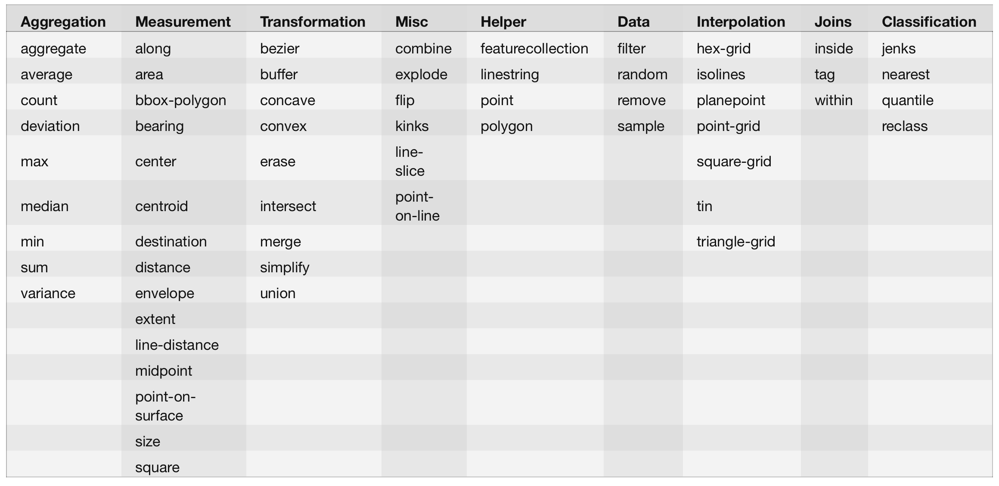
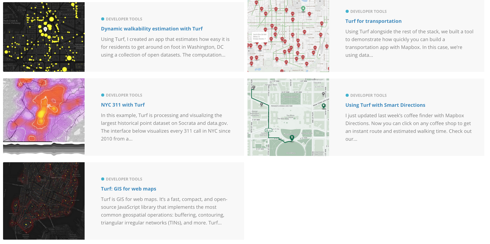

# Web Maps!!

---

# Show of hands:

- [Leaflet](http://leafletjs.com/)?
- [OpenStreetMap](http://openstreetmap.org)?
- [Google Maps API](https://developers.google.com/maps/)
- [Mapbox.js](https://www.mapbox.com/mapbox.js)

---

# How about PostGIS?

`CREATE EXTENSION postgis;`

## Shapes, boundaries, centroids, etc.

---

# Enter [Turf.js](http://turfjs.org)

## From our __friends__ at

---

Morgan Herlocker

[bio](https://www.mapbox.com/about/team/#morgan-herlocker)
|
[github](https://github.com/morganherlocker)

---

Special shoutout: Lyzi Diamond

[bio](https://www.mapbox.com/about/team/#lyzi-diamond)
|
[github](https://github.com/lyzidiamond)

---

# raison d'être:
## Geospatial analysis in the browser.

---

# Lots of dope libraries!

---

---

[(some examples from the Mapbox blog)](https://www.mapbox.com/blog/#stq=turf&stp=2)
